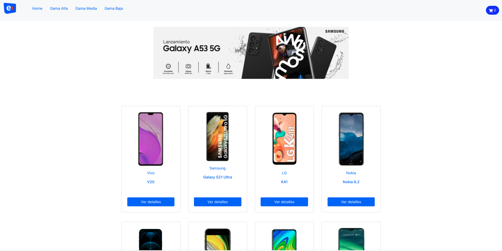
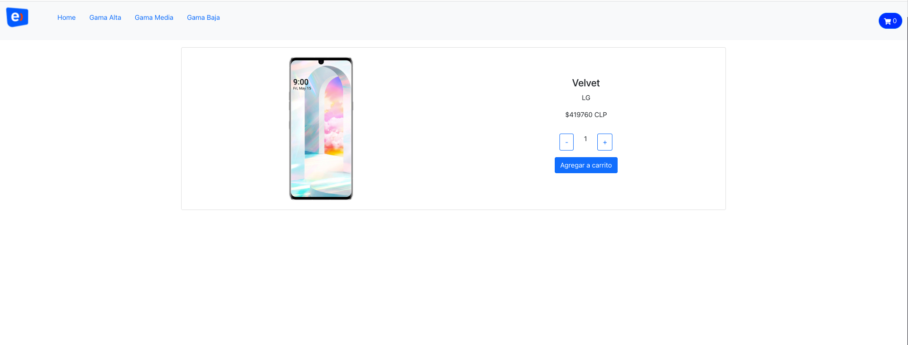

  
    
        
  

# Tienda Teléfonos Entel

E-commerce desarrollado en React, como tienda virtual de dispositvos smartphone para venta al público. Se utiliza tienda clon de Entel.

\*Informo que no soy propietaria de la marca Entel, y su uso para este proyecto es exclusivamnete con fines educativos, que reflejan el uso de React Js como framework Front-End.

## Demo

> 

---

## Funcionalidad del proyecto

Esta web muestra los productos a la venta, navegando por el catálogo a través de del filtrado de las categorías: Gama Alta, Gama Baja, Gama Media.

---

_Index_

> 

---

_Detalle de Producto_

> 

---

---

**Dependencias del proyecto:**

> - **React Icons:** https://react-icons.github.io/react-icons/
> - **React Bootstrap:** https://react-bootstrap.github.io/ <i class="icon-upload"></i>

**Navegabilidad / Componentes**

> - [x] Responsive / estilos aplicados de forma estética.
> - [x] Manejo de imágenes.
> - [x] camelCase para eventos.
> - [x] PascalCase para componentes.
> - [x] Routes y Links para navegaciones.
> - [x] Navbar con botón de carrito implementado.
> - [x] Promises y Hooks.

---
